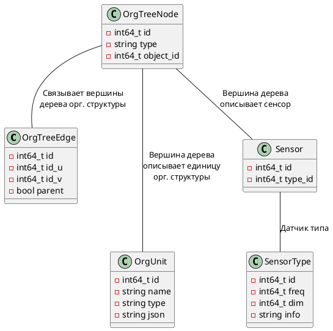

# Модель данных

## Модель данных в PostgreSQL

```plantuml
@startuml
class OrgTreeEdge {
  -int64_t id
  -int64_t id_u
  -int64_t id_v
  -bool parent
}

class OrgTreeNode {
  -int64_t id
  -string type
  -int64_t object_id
}

class OrgUnit {
  -int64_t id
  -string name   
  -string type
  -string json
}

class Sensor{
 -int64_t id
 -int64_t type_id
}

class SensorType{
  -int64_t id
  -int64_t freq
  -int64_t dim
  -string info
}

OrgTreeNode -- OrgTreeEdge: "Связывает вершины\nдерева орг. структуры"

OrgTreeNode --- OrgUnit: "Вершина дерева\nописывает единицу\nорг. структуры"

OrgTreeNode -- Sensor: "Вершина дерева\nописывает сенсор"

Sensor -- SensorType: "Датчик типа"
@enduml
```
