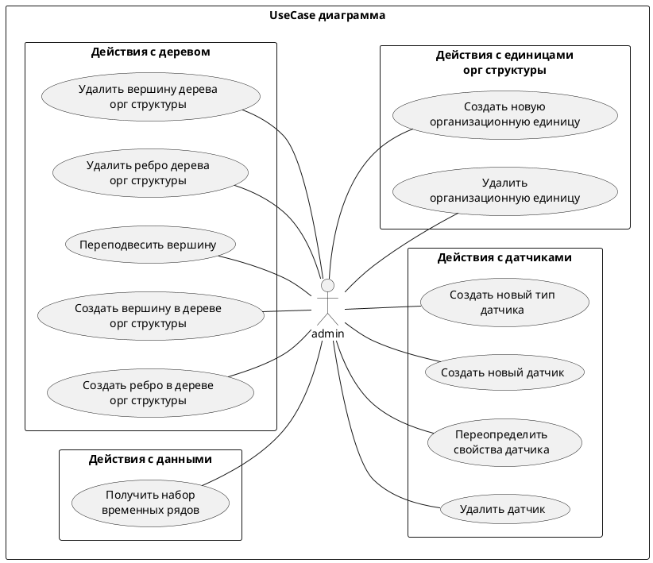

# Процессы по работе с данными

```plantuml
@startuml
left to right direction
skinparam packageStyle rect

rectangle "UseCase диаграмма"{
  actor admin

  rectangle "Действия с деревом" {
    admin -up- (Создать ребро в дереве\nорг структуры)
    admin -up- (Создать вершину в дереве\nорг структуры)
    admin -up- (Переподвесить вершину)
    admin -up- (Удалить ребро дерева\nорг структуры)
    admin -up- (Удалить вершину дерева\nорг структуры)
  }

  rectangle "Действия с данными" {
    admin -up- (Получить набор\nвременных рядов)
  }

  rectangle "Действия с датчиками" {
    admin -down- (Создать новый тип\nдатчика)
    admin -down- (Создать новый датчик)
    admin -down- (Переопределить\nсвойства датчика)
    admin -down- (Удалить датчик)
  }

  rectangle "Действия с единицами\nорг структуры" {
    admin -down- (Создать новую\nорганизационную единицу)
    admin -down- (Удалить\nорганизационную единицу)
  }
}

@enduml
```
